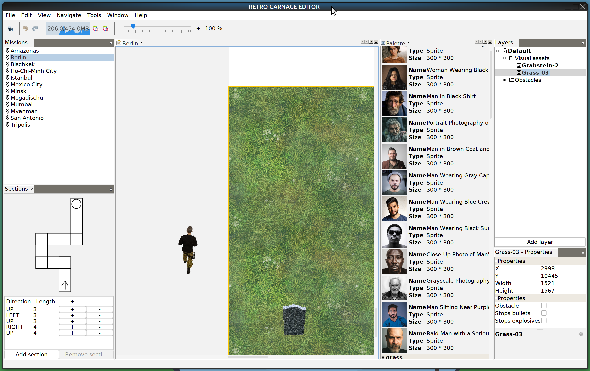

# Editor

Repository: https://github.com/huddeldaddel/retro-carnage-editor

## Build & Run

The level editor is based on the [Apache NetBeans Rich Client Platform](https://netbeans.apache.org/about/index.html#_the_apache_netbeans_platform). The easiest way to build it is to clone the repository and open it in the [Apache NetBeans IDE](https://netbeans.apache.org/).
