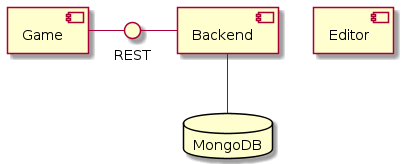

# RETRO CARNAGE

The goal of this project is to take you back to the best part of your childhood. To do this, we are building a modern multidirectional scrolling shooter. Once finished, Retro-Carnage is going to be a worthy successor of classic video games like [Ikari Warriors](https://en.wikipedia.org/wiki/Ikari_Warriors) by [SNK](http://www.snk-corp.co.jp/), [War Zone](https://core-design.com/warzone.html) by [Core Design](https://core-design.com/), or [Dogs of War](https://en.wikipedia.org/wiki/Dogs_of_War_(1989_video_game)) by [Elite Systems](http://www.elite-systems.co.uk). You can find the current state of development on the official homepage of the game: [http://www.retro-carnage.net](http://www.retro-carnage.net).

This documentation provides an overview about the structure of the project and its building blocks. Building and running the game is easy - this documentation explains how.

## Structure

| Component                 | Description                                                                                |
| ------------------------- | ------------------------------------------------------------------------------------------ |
| **[Game](game.md)**       | RETRO CARNAGE is a game.                                                                   |
| **[Backend](backend.md)** | Used to collect anonymous usage data and error reports.                                    |
| **[Editor](editor.md)**   | A WYSIWYG level editor you can use to modify the game content and build your own missions. |
| **MongoDB**               | The backend stores all permanent data in this NoSQL database.                              |

## Other resources

- [Game website](http://www.retro-carnage.net)
- [Game on GitHub](https://github.com/huddeldaddel/retro-carnage)
- [Backend on GitHub](https://github.com/huddeldaddel/retro-carnage-backend)
- [Gameplay videos on YouTube](https://www.youtube.com/channel/UCzZqwKAbXmn_azXxBgwWS3g)
